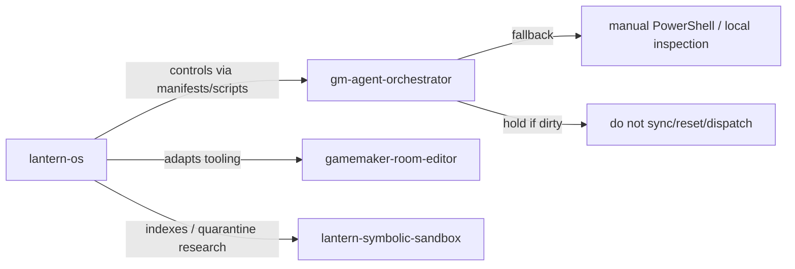
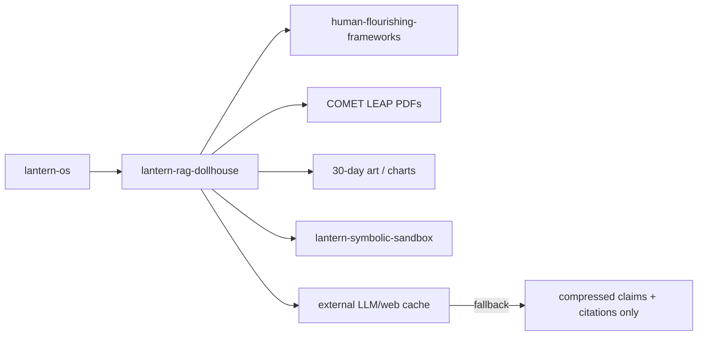
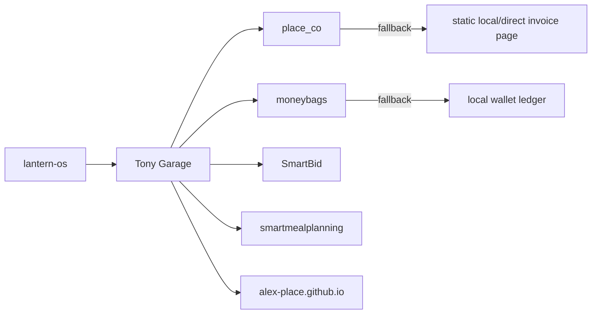
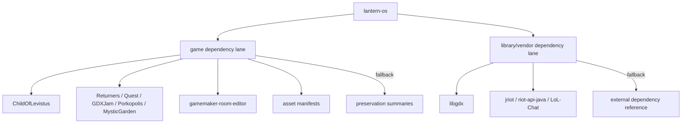
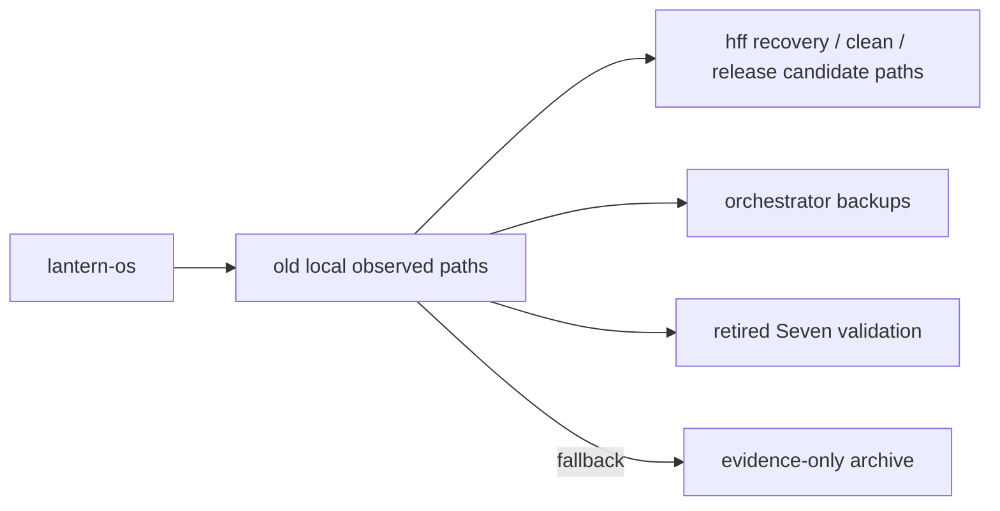

# Lantern OS Top-Down Dependency Graph

Status: architecture refactor manifest.

## Core Position

Lantern OS is the top-down project, product spine, release/control plane, and operator interface.

All old repositories and codebases are dependencies. They feed Lantern OS through adapters, manifests, RAG summaries, validation receipts, or selected promoted artifacts. They do not define the project boundary by themselves.

## Top-Down Control Graph

```mermaid
graph TD
  L[Lantern OS control plane] --> OP[Operator cockpit / Tony Garage]
  L --> RAG[Lantern RAG dollhouse]
  L --> EXE[Execution plane]
  L --> PROD[Product and revenue surfaces]
  L --> DEV[Device and local runtime plane]
  L --> GOV[Governance / validation / release gates]

  RAG --> HFF[human-flourishing-frameworks]
  RAG --> SYM[lantern-symbolic-sandbox]
  RAG --> PDF[COMET LEAP PDFs and copied owned assets]
  RAG --> WEB[metadata-only web/cache lanes]

  EXE --> ORCH[gm-agent-orchestrator]
  EXE --> GMTOOL[gamemaker-room-editor]
  EXE --> MON[statusmonitor / intspeedcheck / sloth services]

  PROD --> PLACE[place_co]
  PROD --> MONEY[moneybags]
  PROD --> BID[SmartBid]
  PROD --> MEAL[smartmealplanning]
  PROD --> SITE[alex-place.github.io]

  DEV --> GAME[Game and GameMaker repos]
  DEV --> LIB[libgdx / jriot / riot-api-java]
  DEV --> DESK[desktop utilities]

  GOV --> VAL[validation receipts]
  GOV --> HELD[held boundaries]
  GOV --> FALL[explicit fallbacks]
```



## Dependency Edge Types

| Edge | Meaning | Allowed Movement |
|---|---|---|
| `controls` | Lantern OS invokes or supervises the surface | manifest command, validation receipt, adapter script |
| `indexes` | Lantern OS reads metadata or summaries | RAG chunks, hashes, excerpts, citations |
| `copies_selected_assets` | Selected literal assets are copied | only owned/approved assets with hashes |
| `adapts` | Lantern OS wraps an existing repo command/API | adapter script, config, health check |
| `promotes` | Code/artifact moves into Lantern OS | small reviewed commit after validation |
| `references` | Dependency remains external | link, manifest, source path, fallback |
| `holds` | Not safe to run/promote yet | operator approval, credentials, hardware, rights, secrets |

## Dependency Graph By Lane

### Lane 1: Control And Execution



Fallbacks:

- If orchestrator MCP is unavailable, use local PowerShell read-only inspection.
- If agent fleet config is missing, hold all 600-agent claims until `agents`, queues, active, failed, and MCP tools are verified locally.
- If a worktree is dirty, do not reset, clean, sync, or dispatch until status is recorded and operator approves.

### Lane 2: RAG And Evidence



Fallbacks:

- If raw repo/code cannot be cloned, keep repo as `github_metadata_only`.
- If assets are large or rights are unclear, store metadata and hashes only.
- If web/LLM claims are not verified, mark `needs_verification` and keep out of release claims.

### Lane 3: Product / Revenue / Sites



Fallbacks:

- If payment/provider integration is not verified, use local invoice/draft ledger only.
- If site deploy is unavailable, use static local package and direct-send PDF/HTML.
- If service repos contain unknown secrets/env, hold runtime claims until inspected.

### Lane 4: Games, GameMaker, Libraries, And Content



Fallbacks:

- Do not bulk-copy game assets into Lantern OS.
- Treat `libgdx` as vendor-sized and external unless a specific fork delta is identified.
- If build toolchains are old or unknown, record runtime/toolchain and keep modernization as a separate project.

### Lane 5: Retired, Backup, And Placeholder Paths



Fallbacks:

- Retired paths are evidence only.
- Backup paths are never active runtime unless explicitly restored in a controlled recovery plan.
- Placeholder repos remain held until assigned purpose.

## Fallback Decision Matrix

| Failure / Unknown | Fallback | Claim Allowed? |
|---|---|---|
| repo not cloned | `github_metadata_only` | repo exists only |
| local repo dirty | record dirty state and hold mutation | status claim only |
| build command unknown | dependency profile pending | no runtime claim |
| tests absent | manual validation receipt required | limited claim only |
| secrets/env unknown | hold run/deploy | no deploy claim |
| large assets | manifest/hash only | metadata claim only |
| rights unclear | rights gate | no distribution claim |
| MCP unavailable | local read-only PowerShell checks | no live-tool claim |
| queue/fleet unverified | hold capacity claim | no 600-agent claim |
| physical disk/boot action needed | operator-held | no install claim |

## Required Refactor Output

The top-down model is complete when these files exist and are kept current:

```text
manifests/ALL-REPOS-INVENTORY.md
manifests/TOP-DOWN-DEPENDENCY-GRAPH.md
manifests/ALL-REPOS-CODE-SURFACES.md
manifests/ALL-REPOS-RAG-INTAKE.md
manifests/ALL-REPOS-VALIDATION-MATRIX.md
references/LANTERN-ALL-REPOS-CODE-RAG.flat.md
```

## Working Rule

Every future repo action should answer:

1. What Lantern OS top-level surface needs this?
2. Which dependency provides it?
3. What is the read-only evidence?
4. What command, adapter, manifest, or RAG summary is needed?
5. What is the fallback if the dependency is unavailable?
6. What claim is safe after validation?
